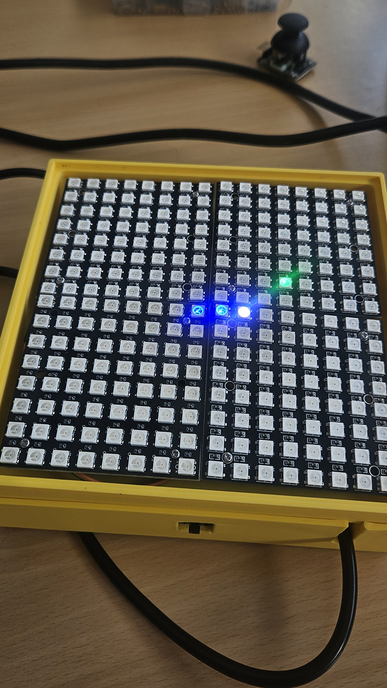
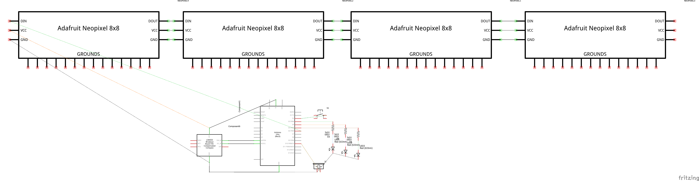
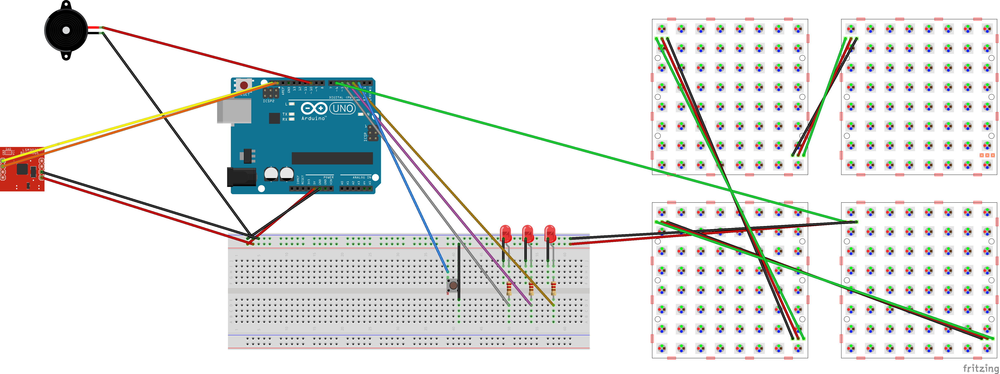

# 🐍 Snake Arduino — Contrôle par accéléromètre (ICM-20948)

Projet réalisé dans le cadre du cours Arduino — Ingénierie des Médias (HEIG-VD)

---

## 📋 Description

Ce projet consiste en l’implémentation du jeu **Snake** sur un affichage LED adressable, contrôlé par l’inclinaison physique de la carte Arduino à l’aide d’un capteur IMU **ICM-20948** (accéléromètre + gyroscope).

Le système a été conçu de manière **modulaire et évolutive** afin de pouvoir fonctionner sur un ou plusieurs panneaux LED (ex. 1 panneau 8×8 pour les tests, puis 4 panneaux assemblés pour une surface d’affichage plus grande).

## 🎯 Motivations du projet

Ce projet vise à explorer une interaction plus **physique et intuitive** avec un jeu vidéo classique.  
Plutôt que d'utiliser un contrôleur traditionnel (boutons ou joystick), le joueur contrôle le serpent en **inclinant la carte Arduino**, ce qui transforme le dispositif en interface tangible.

Les motivations principales du projet étaient :

- expérimenter l’utilisation d’un **capteur IMU (accéléromètre + gyroscope)** avec Arduino
- apprendre à **traiter et filtrer des données de capteurs**
- créer une **interaction ludique et originale** avec un dispositif électronique
- implémenter un **jeu complet sur un microcontrôleur avec des ressources limitées**

Le jeu Snake a été choisi car il possède une **logique simple et bien connue**, permettant de se concentrer sur l’interaction et l’affichage.

---

## 📚 Mini état de l’art

Plusieurs projets et approches similaires ont servi d’inspiration pour ce dispositif.

### Snake sur matrice LED avec Arduino

De nombreux projets Arduino implémentent le jeu Snake sur une **matrice LED**, souvent contrôlée par joystick ou boutons.  
Ces projets démontrent comment gérer une grille de pixels, les déplacements du serpent et les collisions dans un environnement embarqué.

Exemple :  
https://projecthub.arduino.cc/

---

## 🧾 Recette pour reproduire le dispositif

### 1. Installer les bibliothèques Arduino

Dans l’IDE Arduino, installer les bibliothèques suivantes :

- `Adafruit NeoPixel`
- `SparkFun ICM-20948 Arduino Library`
- `Wire` (incluse par défaut)

---

### 2. Assembler le circuit

Connecter les composants selon le **schéma électronique fourni** :

- connecter le capteur IMU en **I2C**
- connecter la matrice LED WS2812 sur la pin **D6**
- connecter le buzzer et les LEDs de vies
- connecter le bouton restart en **INPUT_PULLUP**

---

### 3. Téléverser le programme

1. Ouvrir le fichier `.ino` dans l’IDE Arduino  
2. Sélectionner la carte **Arduino Uno**  
3. Compiler le programme  
4. Téléverser le code sur la carte

---

### 4. Calibration du capteur

Au démarrage du jeu, la carte doit être **posée à plat** pendant quelques secondes afin que le programme puisse effectuer une calibration automatique de l’accéléromètre.

---

### 5. Jouer

Incliner la carte Arduino pour déplacer le serpent :

- inclinaison gauche → déplacement vers la gauche  
- inclinaison droite → déplacement vers la droite  
- inclinaison vers l’avant → déplacement vers le haut  
- inclinaison vers l’arrière → déplacement vers le bas  

---

## ⚠️ Difficultés rencontrées

### Bruit du capteur

Les données brutes de l’accéléromètre contiennent du **bruit**, ce qui provoquait des mouvements instables du serpent.

Solution :

- mise en place d’un **filtre passe-bas**
- calcul du **pitch et du roll** pour obtenir une orientation plus stable

---

### Sensibilité du contrôle

Au début, de petites inclinaisons déclenchaient des mouvements involontaires.

Solution :

- ajout d’un **seuil d’activation**
- calibration automatique au démarrage

---

### Gestion de la logique du jeu

Certaines situations provoquaient des **freezes ou des états incohérents** lors des collisions.

Solution :

- amélioration de la gestion des états du jeu
- refactorisation du code pour une logique plus claire

---


## 🔮 Améliorations possibles

Plusieurs évolutions pourraient être envisagées :

- ajouter un **score affiché**
- implémenter un **menu de démarrage**
- enregistrer un **high score**
- ajouter des **animations visuelles et effets lumineux**

---

## 📸 Prototype final



---

## 🧪 Évolution du projet

### 🎮 V1 — Contrôle par joystick
- Déplacement du serpent avec un joystick analogique
- Première implémentation du moteur du jeu Snake
- Validation de la logique de déplacement et des collisions

### 🧭 V2 — Contrôle par accéléromètre (première implémentation)
- Remplacement du joystick par l’IMU ICM-20948
- Lecture brute de l’accéléromètre
- Apparition de bruit et de contrôles peu intuitifs
- Premiers tests de pitch/roll

### 🚀 V3 — Accéléromètre optimisé 
- Filtre passe-bas sur les axes X, Y, Z
- Calcul du pitch et du roll à partir des données filtrées
- Calibration automatique au démarrage
- Contrôle plus stable et intuitif
- Correction des freezes et du game over
- Système de vies + LEDs indicatrices
- Code refactorisé et propre
### ⚡ V4 — Accéléromètre optimisé (version actuelle)
- 4 matrices led
---

## ✨ Fonctionnalités

- 🎮 Contrôle du serpent par inclinaison (IMU ICM-20948)
- 💡 Affichage sur panneau(x) LED WS2812 (adressables)
- ❤️ Système de 3 vies avec LEDs indicatrices
- 🍏 Génération aléatoire des pommes
- ⚡ Accélération progressive du jeu
- 🔊 Effets sonores (manger, perdre une vie, game over)
- ❌ Affichage Game Over (croix rouge)
- 🔁 Bouton de redémarrage (restart)
- 🧠 Filtre passe-bas sur l’accéléromètre

---

## 🛠️ Matériel utilisé

- Arduino Uno (ou compatible)
- Panneau(x) LED WS2812 (8×8)
- IMU ICM-20948 (I2C)
- Buzzer passif
- 3 LEDs + résistances 220Ω (indicateur de vies)
- Bouton poussoir
- Breadboard + câbles Dupont

---


## 🔌 Câblage (configuration actuelle de test)

### IMU ICM-20948 (I2C)
| Arduino | IMU |
|--------|-----|
| 5V | VCC / VIN |
| GND | GND |
| A4 | SDA / DA |
| A5 | SCL / CL |

> Adresse I2C utilisée : `0x69` (AD0 = HIGH)

### LEDs de vies
| Arduino | Fonction |
|--------|----------|
| D3 | Vie 1 |
| D4 | Vie 2 |
| D5 | Vie 3 |

### Buzzer
| Arduino | Buzzer |
|--------|--------|
| D9 | + |
| GND | - |

### Bouton Restart
| Arduino | Bouton |
|--------|--------|
| D2 | Bouton |
| GND | GND (INPUT_PULLUP) |

### Affichage LED (WS2812)
| Arduino | LED |
|--------|-----|
| D6 | DIN |
| 5V | VCC |
| GND | GND |

## 🎮 Câblage — Version V1 (Joystick)

La première version du projet utilisait un joystick analogique pour contrôler le serpent avant le passage au contrôle par accéléromètre (V2/V3).

### Joystick analogique (XY + bouton)

| Arduino | Joystick |
|--------|----------|
| 5V | VCC |
| GND | GND |
| A0 | VRx (axe horizontal) |
| A1 | VRy (axe vertical) |
| D7 (optionnel) | SW (bouton du joystick) |

### Fonctionnement (V1)
- VRx : gauche / droite
- VRy : haut / bas
- SW : restart (optionnel)


---

## 📦 Bibliothèques Arduino

À installer via le gestionnaire de bibliothèques :

- `Adafruit NeoPixel`
- `SparkFun ICM-20948 Arduino Library`
- `Wire` (incluse par défaut)

---

## 🚀 Installation

```bash
git clone https://github.com/leabugnon/snake-arduino.git
